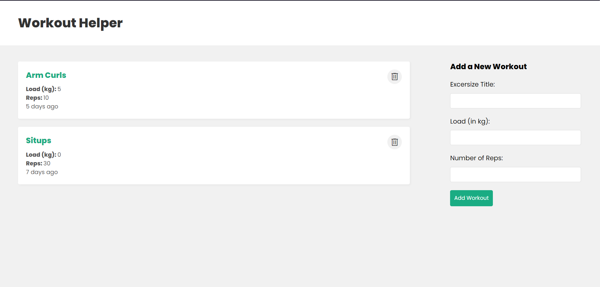

# Workout Tracker

Track and manage your fitness journey with ease using this Workout Tracker built with the MERN stack! This web application allows users to log their workouts, monitor progress, and stay motivated on their path to a healthier lifestyle.

## Features

- Create, Read, Update, and Delete (CRUD) workouts and exercises.
- User-friendly interface for adding and editing workout details.
- Responsive design for seamless usage across various devices.
- Built with the powerful MERN stack: MongoDB, Express.js, React, and Node.js.

## Getting Started

1. Clone the repository and navigate to the project directory.
2. Run `npm install` to install the required dependencies.
3. Set up your MongoDB database and update the connection configuration.
4. Run `npm start` to launch the development server.
5. Open your browser and access the app at [http://localhost:3000](http://localhost:3000).

## Contributions

Contributions and feedback are welcome! Whether you're a fitness enthusiast or a developer, you can help enhance this project. Feel free to submit pull requests for new features, bug fixes, or optimizations.

## Screenshots

## License

This project is licensed under the MIT License. See the [LICENSE](link-to-license) file for more details.
